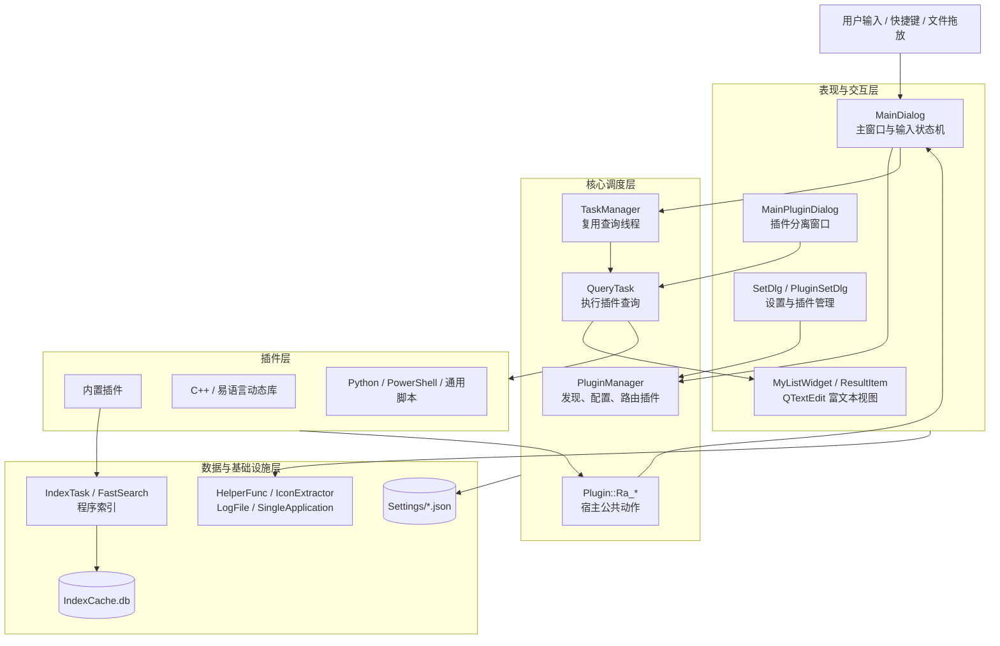
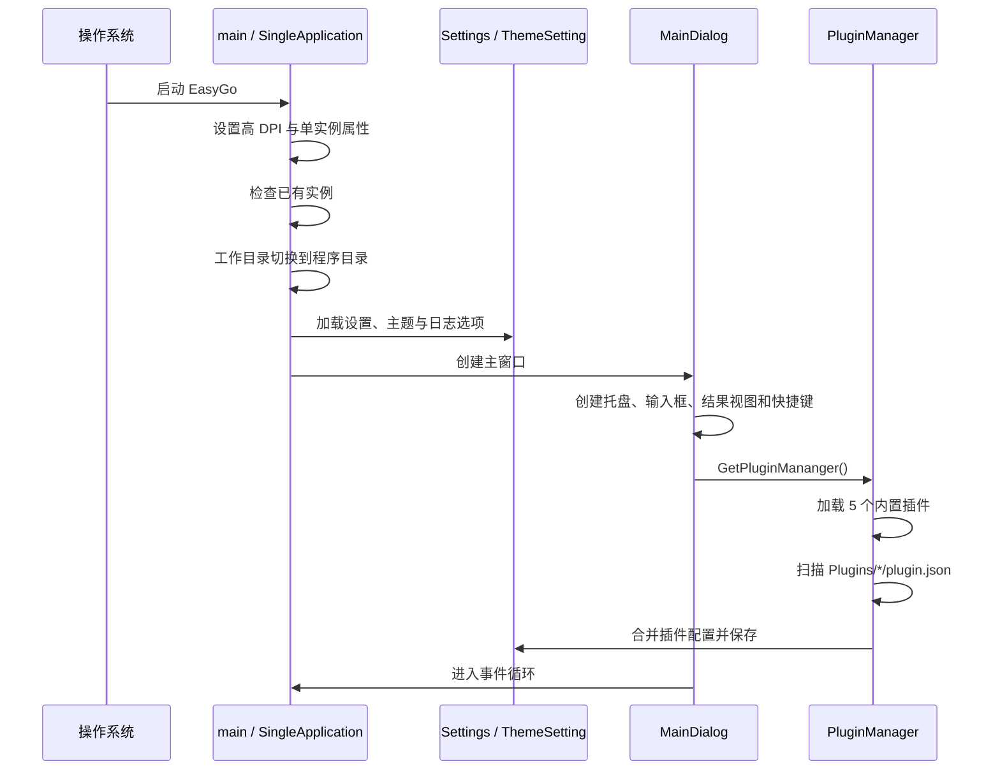
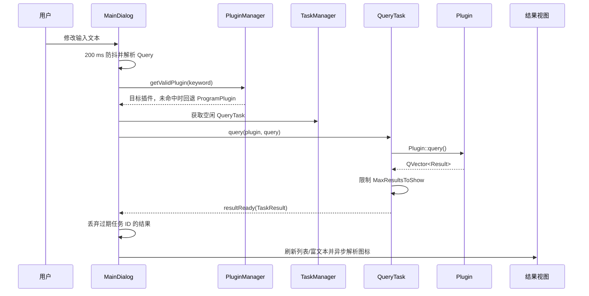

# EasyGo 工程架构文档

> 文档版本：1.0
>
> 对应程序版本：2.0.1（见 `Settings.h`）
>
> 基准分支：`main`
>
> 最后更新：2026-08-30

## 1. 文档目的

本文档描述 EasyGo 当前源码的整体结构、核心数据模型、运行流程、插件机制、索引系统和构建发布方式，供后续功能开发、插件接入、问题排查和跨平台维护使用。

EasyGo 是一个基于 Qt Widgets 的快捷启动器。主程序负责输入交互、插件路由、异步查询、结果展示和公共动作；具体检索或业务能力由内置插件及外部插件提供。

## 2. 总体架构



架构上采用“宿主程序 + 统一插件抽象”的模式：

- `MainDialog` 是主交互控制器，维护输入模式并驱动查询和结果操作。
- `PluginManager` 统一管理内置与外部插件，根据关键字或文件类型完成路由。
- `QueryTask` 将查询放在线程中执行，以信号将统一结果模型返回界面。
- `Plugin` 定义语言无关的查询、菜单和点击接口，并提供 `Ra_*` 宿主动作。
- 外部插件通过 `plugin.json` 声明元数据，通过动态库 ABI 或子进程标准输出与宿主通信。
- 程序检索由内置 `ProgramPlugin` 完成，索引持久化到 SQLite。

## 3. 技术栈与工程形态

| 项目 | 当前实现 |
| --- | --- |
| 编程语言 | C++、少量 Python 桥接代码 |
| GUI | Qt 5 Widgets |
| 构建系统 | qmake，入口为 `EasyGo.pro` |
| Qt 模块 | Core、Gui、Widgets、Sql、Network、Concurrent、Multimedia |
| 数据存储 | JSON 配置文件、SQLite 程序索引 |
| 插件载入 | `QLibrary`、`QProcess` |
| 全局快捷键 | QxtGlobalShortcut |
| 压缩包处理 | QuaZIP |
| 支持平台 | Windows、Linux |
| 发布构建 | GitHub Actions，Windows ZIP 与 Linux DEB |

工程生成单一可执行程序 `EasyGo`。Windows 构建链接 QuaZIP 及系统库；Linux 构建使用系统 Qt 5，并对平台差异使用 `Q_OS_WIN32`、`Q_OS_LINUX` 条件编译。

## 4. 源码模块划分

### 4.1 启动与应用生命周期

| 文件 | 职责 |
| --- | --- |
| `main.cpp` | 高 DPI 配置、单实例检查、日志初始化、全局字体、主窗口创建、重启退出码处理 |
| `singleapplication.*` | 单实例应用封装 |
| `DumpFile.*` | Windows 异常转储相关能力 |
| `LogFile.*` | 文件日志接口 |

### 4.2 主界面与交互

| 文件 | 职责 |
| --- | --- |
| `MainDialog.*` | 主窗口、托盘、快捷键、输入状态机、查询调度、结果操作、拖放安装和文件处理 |
| `MainPluginDialog.*` | `Ctrl+Y` 创建的插件独立窗口，复用查询与结果交互逻辑 |
| `MyLineEdit.*` | 输入框扩展和二级输入分隔显示 |
| `MyListWidget.*` | 结果列表及鼠标操作信号 |
| `ResultItem.*` | 单条结果的标题、副标题、图标和播放状态展示 |
| `ShowContentDlg.*` | 内容、提示及文件编辑窗口 |
| `IconExtractor.*` | 异步解析本地图标或主题图标 |
| `ThemeSetting.*` | 主题解析、颜色回退和公共样式生成 |

`MainDialog.ui` 只包含基础窗口，输入框、进度条、列表和富文本控件主要在 `MainDialog` 构造函数中创建和布局。

### 4.3 插件核心

| 文件 | 职责 |
| --- | --- |
| `Plugin.h/.cpp` | 公共数据模型、插件抽象、各语言适配器、宿主 `Ra_*` 动作 |
| `PluginManager.*` | 加载、增删、启停、关键字路由和文件类型路由 |
| `QueryTask.*` | 在线程中调用插件并封装 `TaskResult` |
| `TaskManager.*` | 返回已结束的查询线程或创建新线程 |
| `PluginSetDlg.*` | 插件配置界面 |
| `InstallDlg.*` | 插件覆盖安装选项 |

### 4.4 内置插件

内置插件直接编译到主程序，由 `PluginManager::loadDefaultPlugin()` 创建，不依赖 `Plugins/` 目录。

| 插件 | 固定 ID 尾号 | 主要职责 |
| --- | --- | --- |
| `ProgramPlugin` | `...0001` | 程序检索、插件关键字补全、排序、置顶及打开程序 |
| `WebSearchPlugin` | `...0002` | 可配置的网页搜索入口 |
| `EpmPlugin` | `...0003` | 插件仓库查询、安装、卸载和代理设置 |
| `OptionPlugin` | `...0004` | 快速修改应用选项 |
| `ThemePlugin` | `...0005` | 切换主题和圆角配置 |

### 4.5 程序索引与排序

| 文件 | 职责 |
| --- | --- |
| `IndexTask.*` | 后台遍历索引路径并生成程序记录 |
| `IndexDatabase.*` | SQLite 表创建、批量写入和模糊查询 |
| `FastSearch.*` | Windows 下基于 NTFS USN 的快速枚举 |
| `ChineseLetterHelper.*` | 中文名称拼音首字母转换 |
| `TopMostRecord.*` | 保存特定查询的置顶结果 |
| `UserSelectRecord.*` | 记录用户选择次数，用于结果排序 |

### 4.6 设置与辅助模块

| 文件 | 职责 |
| --- | --- |
| `Settings.*` | 主设置及插件运行配置读写 |
| `SetDlg.*` | 常规、索引、插件源等设置界面 |
| `HelperFunc.*` | 路径、网络、压缩包、进程及平台辅助函数 |
| `UsageSetting.*` | 启动使用次数记录 |
| `WebSearchSetDlg.*` | 网页搜索项配置 |
| `AboutDialog.*` | 版本与关于信息 |

## 5. 核心数据模型

插件和界面之间不传递具体语言对象，而是统一使用以下结构：

```cpp
struct Query
{
    QString rawQuery;   // 输入框中的完整文本
    QString keyword;    // 用于选择插件的关键字或拖入文件类型
    QString parameter;  // 传给插件的业务参数
};

struct PluginAction
{
    QString funcName;   // Ra_* 宿主动作或插件自定义函数
    QString parameter;
    bool hideWindow;
};

struct Result
{
    QString id;         // 结果所属插件 ID
    int showType;       // 默认列表、富文本或音乐
    QString title;
    QString subTitle;
    QString iconPath;
    QString extraData;
    PluginAction action;
};
```

其他关键类型包括：

- `PluginInfo`：从 `plugin.json` 读取的插件静态元数据。
- `PluginConfig`：用户可修改的关键字、模式、文件类型和启用状态。
- `TaskResult`：查询任务 ID 与 `QVector<Result>` 的组合，用于跨线程传递。
- `InputState`：主界面的输入状态，包含主模式、二级输入标志和附加查询数据。
- `ProgramInfo`：索引中的程序名称、拼音、启动路径及 Linux 图标/desktop 路径。

`Result::showType` 支持三种呈现方式：

| 值 | 含义 |
| --- | --- |
| `SHOW_TYPE_DEFAULT` | 普通结果列表 |
| `SHOW_TYPE_RICHTEXT` | 在只读 `QTextEdit` 中显示文本和图片 |
| `SHOW_TYPE_MUSIC` | 结果项与 `QMediaPlayer` 播放状态联动 |

## 6. 启动流程



重要行为：

1. 程序调用 `QDir::setCurrent(applicationDirPath)`，因此大部分配置和资源使用相对路径，运行目录必须可写。
2. `SingleApplication` 检测到已有实例时，新进程直接退出。
3. 若退出码为 `773`，`main()` 使用当前可执行文件重新启动程序。
4. Windows 发布包若存在内置 `Python/`，会自动写入 Python 目录配置。
5. 主窗口默认驻留系统托盘，最后一个窗口关闭不会终止应用。

## 7. 查询与结果执行流程

### 7.1 输入状态机

| 模式 | 触发方式 | 行为 |
| --- | --- | --- |
| `NormalInput` | 默认输入或实时插件 | 输入变化后 200 ms 防抖并查询 |
| `EnterInput` | 插件配置为回车模式 | 保存查询参数，按 Enter 后执行 |
| `MenuInput` | 对结果执行右键操作 | 暂时显示该结果的上下文菜单，再次右键返回 |
| `DropInput` | 拖入文件或目录 | 按后缀或 `folder` 路由接受该类型的插件 |

Tab 可进入二级输入：程序结果可转成路径附加输入，文件拖放结果可选定具体处理插件。`Ctrl+Y` 会在插件声明 `EnableSeparate` 时创建 `MainPluginDialog`。

### 7.2 普通查询链路



关键字路由规则：

- 输入包含空格时，首段作为 `keyword`，其余作为 `parameter`。
- 无显式插件模式的普通文本使用通配关键字 `*`，通常路由到 `ProgramPlugin`。
- `PluginManager` 同时检查用户配置中的禁用状态和覆盖后的关键字。
- 未找到匹配插件时回退到 `ProgramPlugin`。
- Web 搜索关键字还需在网页搜索配置中处于启用状态。

### 7.3 并发与过期结果控制

- `QueryTask` 继承 `QThread`，插件的 `query()` 在工作线程中同步执行。
- 当前任务仍运行时，`TaskManager` 会返回另一个已结束任务或创建新任务，避免界面等待旧查询结束。
- 每个任务带递增 `m_taskId`；主窗口在实时模式下只接收最新 ID 的结果。
- `stop()` 只设置运行标志并等待线程结束，不能中断正在执行的插件函数或子进程。
- Python、PowerShell 和通用脚本每次调用通过 `QProcess` 启动进程并等待完成，但等待发生在查询线程内。

### 7.4 结果点击与上下文菜单

左键或 Enter 执行 `Plugin::itemClick()`：

- `FuncName` 以 `Ra_` 开头时，通过 Qt 元对象系统调用宿主公共动作。
- 其他函数名由插件适配器回调插件自身实现。
- `HideWindow` 决定动作完成后是否隐藏窗口。
- 右键调用 `Plugin::getMenu()`，菜单项仍复用 `Result` 和 `PluginAction`。

## 8. 插件架构

### 8.1 插件抽象接口

所有插件最终实现同一接口：

```cpp
class Plugin : public QObject
{
public:
    virtual bool initPlugin(QString pluginPath) = 0;
    virtual bool query(Query query, QVector<Result> &results) = 0;
    virtual bool getMenu(Result &result, QVector<Result> &menus) = 0;
    virtual void updateSetting();
    virtual void itemClick(Result &item, QObject *parent = nullptr) = 0;
};
```

`PluginManager` 扫描 `Plugins/` 下的一级目录，通过 `plugin.json` 的 `PluginType` 创建对应适配器。

### 8.2 当前支持的插件类型

| `PluginType` | 适配器 | 通信方式 | 主要入口 |
| --- | --- | --- | --- |
| `c++` | `CPlusPlugin` | `QLibrary` 动态库，普通 C 导出函数 | `InitPlugin`、`Query`、`GetContextMenu`、可选 `UpdateSetting` |
| `e` | `EPlugin` | `QLibrary` 动态库，Windows 下 `__stdcall` | 同上 |
| `python` | `PythonPlugin` | 启动 Python 子进程，命令 JSON 作为参数，结果写 stdout | `InitPlugin`、`Query`、`GetContextMenu`、自定义动作 |
| `powershell` | `PowerShellPlugin` | 启动 `powershell` 子进程 | 同 Python 语义 |
| `script` | `ScriptPlugin` | 由 `Interpreter` 指定解释器启动子进程 | 同 Python 语义 |

README 主要介绍 C++、Python 和易语言；源码中的 PowerShell 与通用脚本适配器也已纳入加载分支。

### 8.3 `plugin.json` 元数据

| 字段 | 用途 |
| --- | --- |
| `ID` | 插件全局唯一标识，也是结果归属 ID |
| `Name`、`Description`、`Author`、`Version` | 展示与版本比较信息 |
| `Keyword` | 字符串或数组；用于输入路由 |
| `Argc` | 参数数量约束 |
| `PluginType` | `c++`、`python`、`e`、`powershell` 或 `script` |
| `PluginMode` | `RealMode` 或 `EnterMode`，缺省为实时模式 |
| `ExeName` | 动态库、Python 模块或脚本入口 |
| `IconPath` | 默认图标相对路径 |
| `AcceptType` | 可处理的逗号分隔文件后缀，目录使用 `folder` |
| `EnableSeparate` | 是否允许 `Ctrl+Y` 分离窗口，缺省为 1 |
| `CfgPath` | 插件配置文件相对路径，覆盖安装时可选择保留 |
| `Platforms` | 支持平台数组；缺省按 `win32` 处理 |
| `Interpreter`、`InterpreterArgv` | 通用脚本解释器及其参数 |
| `Website` | 插件主页 |

### 8.4 JSON 调用协议

C++ 与易语言插件的查询输入包含完整结构：

```json
{
  "RawQuery": "完整输入",
  "Keyword": "插件关键字",
  "Parameter": "业务参数"
}
```

Python、PowerShell 和通用脚本的进程命令结构为：

```json
{
  "FuncName": "Query",
  "Parameter": "业务参数"
}
```

查询返回统一使用：

```json
{
  "Results": [
    {
      "Title": "标题",
      "SubTitle": "副标题",
      "IconPath": "icon.png",
      "ShowType": 0,
      "ExtraData": "附加数据",
      "Action": {
        "FuncName": "Ra_Open",
        "Parameter": "目标路径",
        "HideWindow": true
      }
    }
  ]
}
```

C++ 与易语言接口使用本地编码传递 JSON，Python/脚本桥接以进程标准输出返回 JSON。插件开发时应避免向 stdout 混入普通日志，否则宿主无法解析结果。

### 8.5 宿主公共动作

`Plugin` 提供的 `Ra_*` 动作分为几类：

- 界面控制：`Ra_ChangeQuery`、`Ra_ChangeQueryPara`、`Ra_Reload`、`Ra_ReQuery`。
- 内容展示：`Ra_ShowMsg`、`Ra_ShowTip`、`Ra_ShowContent`、`Ra_EditFile`。
- 文件与系统：`Ra_Open`、`Ra_OpenWeb`、`Ra_OpenFileFolder`、`Ra_Copy`、`Ra_CopyPath`、`Ra_Delete`、`Ra_Recycle`。
- 插件管理：`Ra_Install`、`Ra_Uninstall`、`Ra_ActivePlugin`。
- 排序控制：`Ra_TopResult`、`Ra_DownResult`。
- 媒体播放：`Ra_PlayMusic`、`Ra_PauseMusic`、`Ra_StopMusic`。

这些动作是插件访问宿主能力的边界。新增宿主动作时，需要同时考虑 Qt 可调用签名、C++ 导出符号及脚本端返回协议。

### 8.6 插件安装流程

`.plugin` 文件本质上是压缩包。拖入主窗口后执行以下步骤：

1. 从压缩包读取并校验 `plugin.json`。
2. 检查 `Platforms` 是否支持当前操作系统。
3. 比较已安装版本并询问升级、降级或覆盖。
4. 必要时备份 `CfgPath` 指定的插件配置。
5. 解压到 `Plugins/<Name>/`，名称冲突时追加插件 ID。
6. 调用 `PluginManager::addPlugin()` 完成加载和设置登记。
7. Python 插件存在 `requirements.txt` 时，使用配置的 Python 环境安装依赖。

## 9. 程序索引子系统

### 9.1 索引生成

`IndexTask` 是独立线程，生成过程按平台分支：

- Windows：默认使用 `FastSearch` 读取 NTFS USN 数据；配置为普通索引或 USN 失败时递归扫描 `.exe`、`.lnk`、`.bat`。
- Linux：默认扫描 `/usr/share/applications`、用户 applications 目录、Ubuntu applications 目录和 Snap desktop 目录；解析 `.desktop`，并识别可执行 AppImage。
- Linux 会过滤隐藏、非 Application、桌面环境不匹配、Screensaver 及 `TryExec` 无效的条目，并对 desktop/AppImage 去重。

Windows 索引先写入 `IndexCacheTemp.db`。`ProgramPlugin` 查询时若检测到索引已完成，会用临时库替换 `IndexCache.db`，避免重建过程中破坏当前可查询索引。

### 9.2 数据结构与检索

SQLite 表名为 `program`：

| 字段 | Windows | Linux | 含义 |
| --- | --- | --- | --- |
| `id` | 是 | 是 | 自增主键 |
| `pyname` | 是 | 是 | 名称拼音/首字母形式 |
| `name` | 是 | 是 | 展示名称 |
| `path` | 是 | 是 | 可执行路径 |
| `iconpath` | 否 | 是 | 图标路径或主题图标名 |
| `desktoppath` | 否 | 是 | `.desktop` 路径，用于 `gio launch` |

查询先将输入转换成拼音首字母，再构造模糊匹配。`ProgramPlugin` 合并“可激活插件”与“已索引程序”，然后按以下优先级排序：

1. 用户显式置顶记录。
2. 用户历史选择次数。
3. 插件激活项优先于普通程序。
4. 名称精确匹配、缩写匹配、前缀匹配、包含匹配及拼音匹配。

## 10. 配置与运行时目录

由于启动时将当前目录切换为程序目录，以下均为程序目录下的相对路径：

```text
EasyGo/
├─ EasyGo(.exe)                 # 主程序
├─ Plugins/                     # 外部插件，每个一级目录一个插件
│  └─ <PluginName>/
│     ├─ plugin.json
│     └─ <插件入口与资源>
├─ Settings/
│  ├─ Settings.json             # 主设置和插件配置
│  ├─ ThemeSetting.json         # 主题与圆角
│  ├─ TopMostRecord.json        # 查询置顶记录（运行后生成）
│  ├─ UserSelectRecord.json     # 结果选择统计（运行后生成）
│  └─ Usage.json                # 使用次数（运行后生成）
├─ JsonRPC/PythonPlugin.py      # Python 插件桥接支持
├─ Images/                      # 主程序图片资源
├─ Docs/                        # 插件开发文档
├─ IndexCache.db                # 当前程序索引（运行后生成）
└─ IndexCacheTemp.db            # Windows 重建中的临时索引
```

`Settings.json` 的主要配置域包括：

- 窗口、托盘、快捷键、鼠标和更新检查。
- 每页显示数量及最大查询结果数量。
- Python 目录、插件关键字、模式、文件类型和禁用状态。
- 索引方式及索引路径。
- 插件仓库地址和网络代理。

配置与索引位于安装目录，当前工程属于便携式运行模型，不使用系统用户配置目录。

## 11. 平台差异

| 能力 | Windows | Linux |
| --- | --- | --- |
| 构建工具链 | Qt 5.15.2 + MSVC 2019 x86 | Debian 10 系统 Qt 5 + GCC |
| 程序索引 | NTFS USN 或递归扫描 | `.desktop` 与 AppImage 扫描 |
| 程序启动 | 文件/快捷方式路径 | 优先 `gio launch <desktop>` |
| 动态库依赖 | QuaZIP 预编译库和 Windows 系统库 | 系统包提供依赖 |
| 全局样式 | 系统样式 | 强制 Fusion，确保控件效果一致 |
| Python 默认命令 | `pythonw.exe` | `python3` |
| 易语言调用约定 | `__stdcall` | 普通函数指针分支存在，但实际插件生态主要面向 Windows |
| 发布物 | ZIP | DEB，安装到 `/opt/EasyGo` |

插件的 `Platforms` 字段是安装阶段的平台准入条件。未声明时默认 `win32`，因此跨平台插件必须显式填写 Linux 支持。

## 12. 构建与发布

### 12.1 本地构建

工程入口为 `EasyGo.pro`。典型命令：

```powershell
qmake EasyGo.pro -spec win32-msvc
nmake release
```

Linux：

```bash
qmake EasyGo.pro
make -j$(nproc)
```

### 12.2 CI 发布

`.github/workflows/` 包含手动构建和 tag 发布工作流：

- Windows 使用 Qt 5.15.2 `win32_msvc2019` 构建，基于 `PackEnv/EasyGo.zip` 组装运行环境，再由 `windeployqt` 部署 Qt 依赖。
- Linux 在 Debian 10 容器中构建，组装 `/opt/EasyGo` 与 `/usr/bin/easygo` 的 DEB 包。
- 推送 `v*.*.*` tag 后同时生成 Windows ZIP 与 Linux DEB，并创建 GitHub Release。

`PackEnv/EasyGo.zip` 包含 Windows 发布所需的 Python 运行时、Everything、默认插件和部分第三方动态库；它不是源码构建依赖，但属于 Windows 发布打包基线。

## 13. 依赖方向与扩展原则

推荐保持以下依赖方向：

```text
界面层 → 调度层 → Plugin 抽象 → 插件适配器/内置插件
                    ↓
             配置、索引、辅助设施
```

扩展时遵循以下边界：

- 新业务能力优先实现为插件，避免继续扩大 `MainDialog`。
- 新插件语言只需新增 `Plugin` 适配器，并在 `PluginManager` 的类型识别和构造分支中登记。
- 新结果展示类型需要同步修改 `ShowType`、主窗口和分离窗口的渲染逻辑。
- 新输入模式需要同步维护 `CommonTypes.h`、文本变化处理、按键事件和结果恢复逻辑。
- 新持久化数据优先封装为独立设置类，不让插件直接依赖界面对象。
- 平台专有功能应收敛在条件编译分支或辅助模块中，避免在业务流程中分散判断。

## 14. 已知架构约束

- `MainDialog` 同时承担视图、输入状态、查询协调、插件安装和媒体控制，修改时需重点回归键盘、鼠标、拖放和分离窗口行为。
- `MainPluginDialog` 与主窗口存在较多相似逻辑；新增查询或展示能力时要同步检查两处。
- 多个管理对象通过函数内静态对象提供全局访问，生命周期简单，但依赖关系是隐式的。
- 外部脚本调用没有显式、可配置的超时或主动取消机制，仅使用 `QProcess::waitForFinished()` 的默认等待行为；原生插件调用则可能持续占用查询线程。
- C++/易语言插件共享进程地址空间，错误会影响宿主稳定性；脚本插件拥有进程隔离，但每次调用均有进程启动开销。
- 配置和数据库写入程序目录，部署目录必须具备写权限。
- C++ 与易语言插件协议使用本地编码，跨语言或跨平台时需特别验证中文 JSON。
- 当前查询取消属于“结果失效”而非强制中断，插件实现应尽量快速返回并自行控制网络超时。

## 15. 常见改动定位

| 需求 | 首要修改位置 | 关联检查位置 |
| --- | --- | --- |
| 调整输入解析或快捷键 | `MainDialog.cpp` | `MainPluginDialog.cpp`、`CommonTypes.h` |
| 新增结果字段或动作 | `Plugin.h/.cpp` | 各插件适配器、`ResultItem`、插件开发文档 |
| 修改插件发现和路由 | `PluginManager.cpp` | `Settings.cpp`、`PluginSetDlg.cpp` |
| 修改程序搜索排序 | `ProgramPlugin.cpp` | `TopMostRecord`、`UserSelectRecord` |
| 修改索引来源或格式 | `IndexTask.cpp` | `IndexDatabase.cpp`、`SetDlg.cpp` |
| 修改主题 | `ThemeSetting.cpp` | `MainDialog`、`MainPluginDialog`、各子窗口 |
| 修改插件安装 | `MainDialog::installPlugin()` | `EpmPlugin.cpp`、QuaZIP 辅助函数 |
| 修改发布包 | `.github/workflows/*` | `PackEnv/EasyGo.zip`、`EasyGo.pro` |

## 16. 关键源码入口

- 构建定义：[`EasyGo.pro`](EasyGo.pro)
- 程序入口：[`main.cpp`](main.cpp)
- 主交互控制器：[`MainDialog.cpp`](MainDialog.cpp)
- 公共模型与插件接口：[`Plugin.h`](Plugin.h)
- 插件适配实现：[`Plugin.cpp`](Plugin.cpp)
- 插件管理与路由：[`PluginManager.cpp`](PluginManager.cpp)
- 查询线程：[`QueryTask.cpp`](QueryTask.cpp)
- 程序搜索：[`ProgramPlugin.cpp`](ProgramPlugin.cpp)
- 索引生成：[`IndexTask.cpp`](IndexTask.cpp)
- 索引数据库：[`IndexDatabase.cpp`](IndexDatabase.cpp)
- 主配置：[`Settings.cpp`](Settings.cpp)
- CI 构建：[`.github/workflows/build-release.yml`](.github/workflows/build-release.yml)
